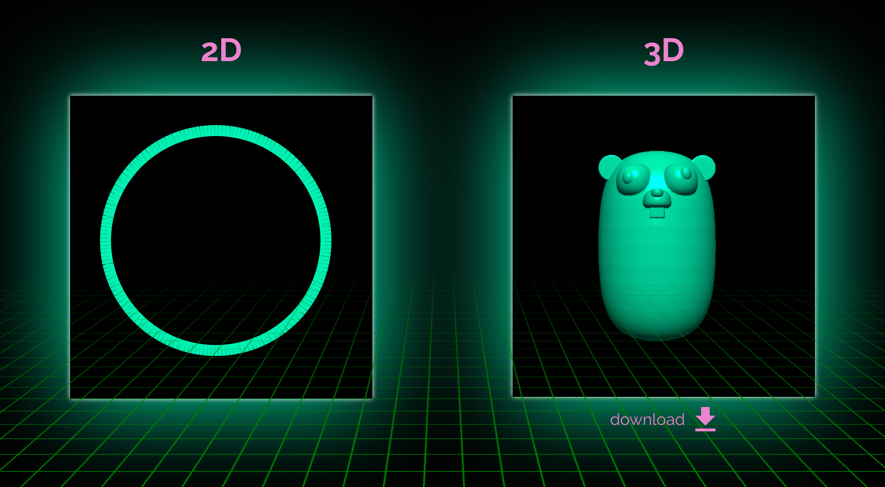
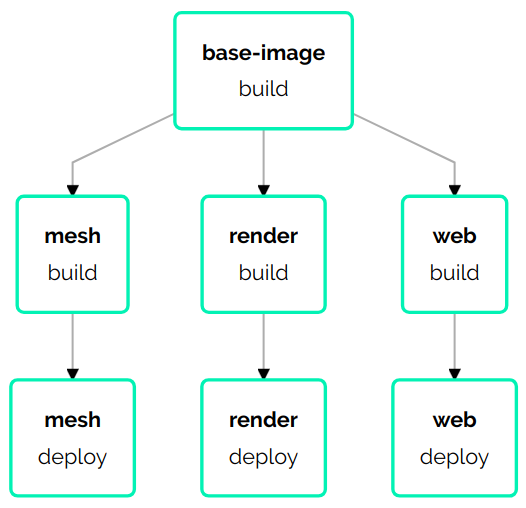

# Go 3D Print 

  

`Go 3D Print` is a demo project showing the basics of creating and rendering 3D mesh with Go. It uses the `sdfx` and `fauxgl` libraries.

This project is split into three microservices: `mesh`, `render`, and `web`.

  

The way it works is:

- `web` constantly polls `mesh` for 2D and 3D objects. 
- If it receives a 2D object, it displays it on the browser.
- If it receives a 3D object, it POSTs it to the `render` service.
- The `render` service, in turn, returns an image of the rendered mesh, which is then displayed on the browser.

To enable live feedback as one explores different 2D/3D forms, this project uses Garden to re-build and re-deploy services whenever the source code changes.

Simply install Garden, clone this repository, and `garden dev`.

  

