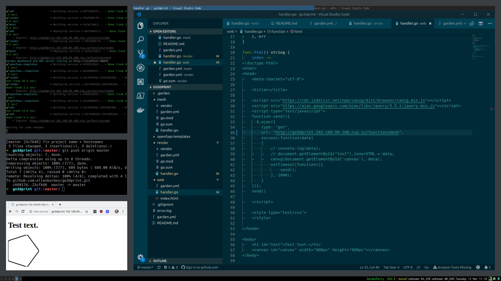

# go3dprint

There are three modules:
- mesh
- render
- web

`mesh` generates 3d mesh or 2d vectors. `render` turns 3d mesh into images. `web` displays either 3d renders or 2d vectors, and updates every second.

The idea is for you to be able to work on your 2d/3d stuff and see it update live as you save, e.g.

You might have to manually update the hostnames on `render/handler.go#30` and `web/handler.go#35`. I couldn't get them to work with the usual templating, don't know why.

The next steps are:
- Currently you need to change the frontend depending on whether you're working with 2d or 3d objects, to display them correctly. I wanna make it so that the frontend adapts to whatever it gets.
- The frontend needs to be prettier. I'll recruit Ben for this once things are more fleshed out.
- I need some silly examples to show how things work in a didactic manner. E.g. how to make a box, how to make a curve and rotate it on its axis to make a 3d object, that kind of thing.
- Gotta come up with a good way to generate the final product (the dilator).